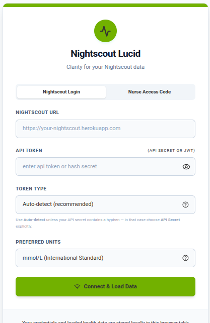
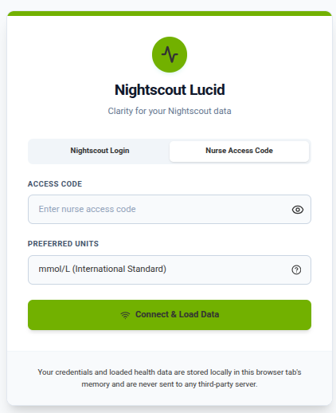
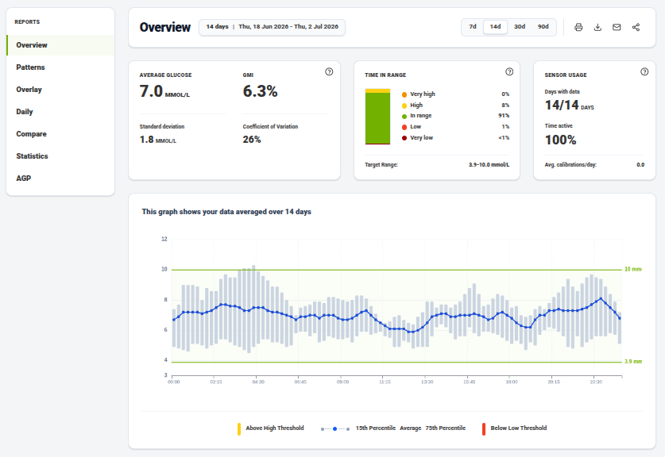
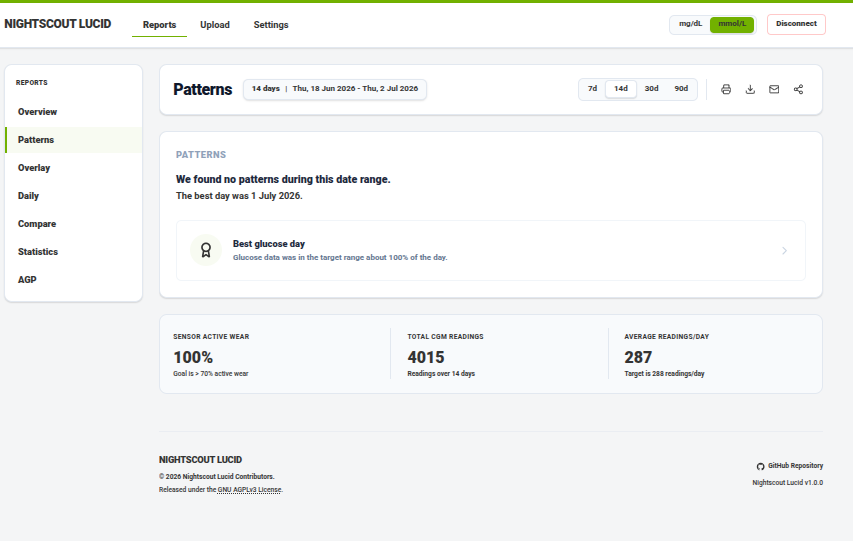
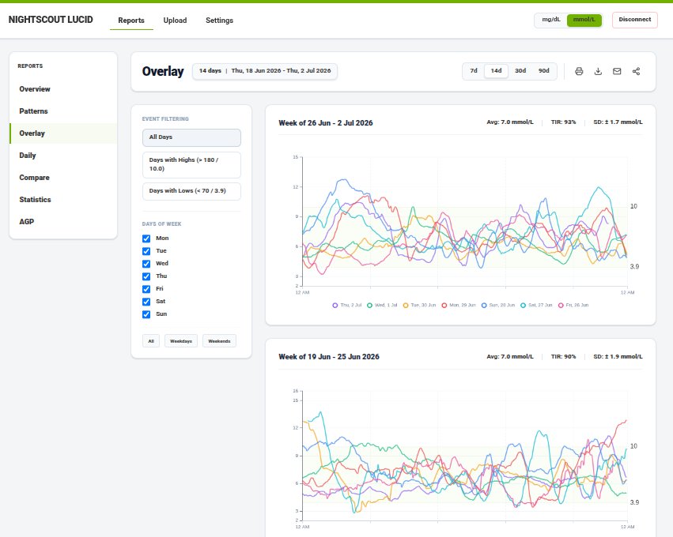
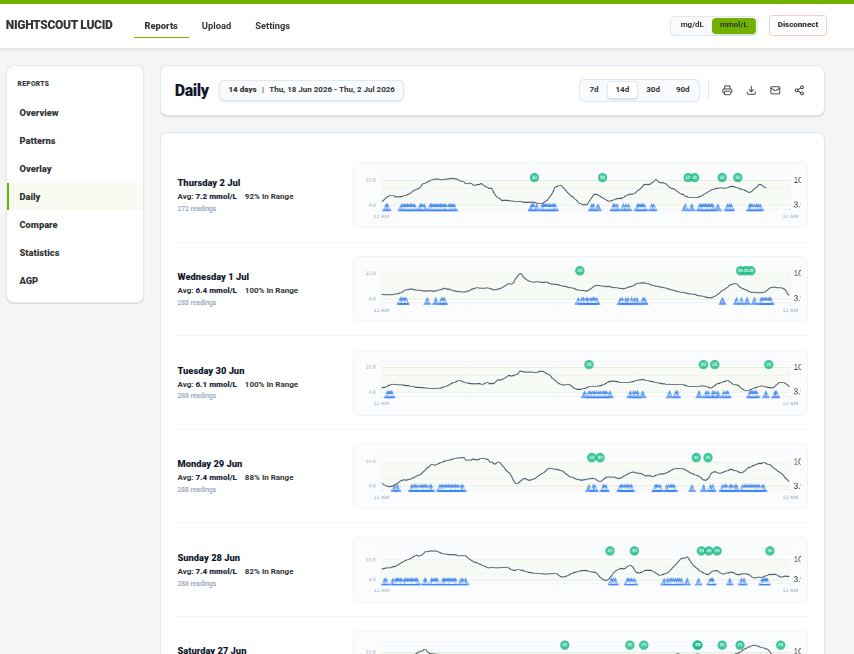
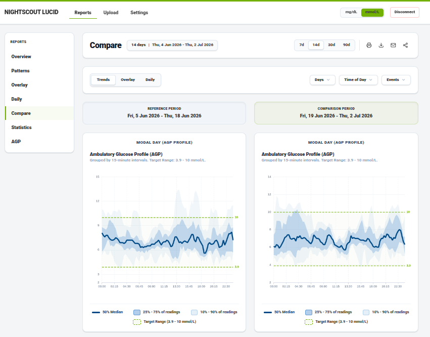
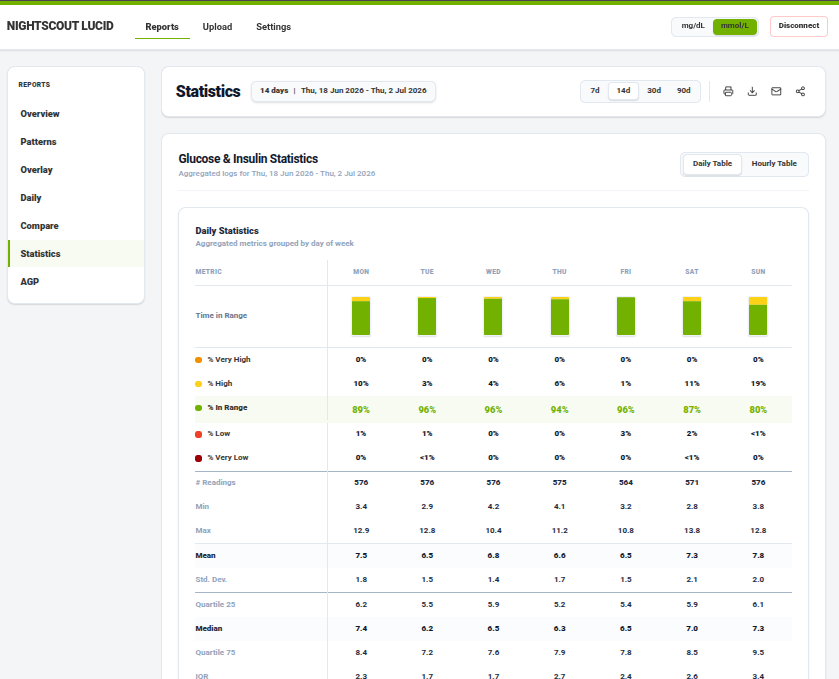
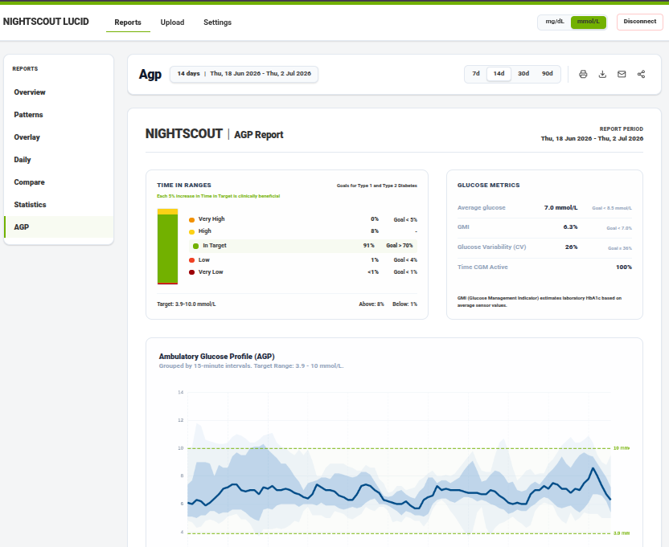

# Nightscout Lucid

A modern, Dexcom Clarity-inspired glucose analytics dashboard that connects directly to your personal [Nightscout](https://nightscout.github.io/) instance. 

This runs in a Docker container which serves a client side report UI that is reminscent of Dexcom Clarity. The whole application runs in browser, no information is stored in the cloud.

See the demo at [https://goodnumbers.net/clarity](https://goodnumbers.net/clarity)

---

## Features

- **Overview**  -  Average glucose, GMI (estimated HbA1c), Coefficient of Variation, and a 5-level Time in Range stacked bar (Very High / High / In Range / Low / Very Low)
- **AGP Profile**  -  Ambulatory Glucose Profile chart (10th, 25th, 50th, 75th, 90th percentiles) with clinical stats header
- **Daily Logs**  -  Per-day mini trend charts with carb/insulin event markers
- **Weekly Overlay**  -  Overlapping 24-hour day curves per week, filterable by day-of-week and event type (Highs/Lows)
- **Statistics**  -  Daily and Hourly tables showing avg glucose, SD/CV, and all 5 TIR percentages
- **Units toggle**  -  Switch between mg/dL and mmol/L at any time
- **Date range**  -  7, 14, 30, or 90-day windows
- **Session-only**  -  Credentials are held in memory; nothing is persisted to a server

---

## AI-driven development

Please note: This software was written primarily with AI, driven by a former software engineer. It's been reviewed by me, and there are many tests to doublecheck the math. But be sure to verify the numbers yourself (eg, sanity check with your Nightscout instance).

---

## Screenshots

### Connection & Login
<p align="center">
  
</p>
The connection screen allows users to input their Nightscout instance URL and API credentials to access their data in-browser.

<p align="center">
  
</p>
An alternative login screen that allows caregivers or clinicians to view reports using a read-only access code.

### Product Reports & Views
<p align="center">
  
</p>
The main dashboard screen displays glucose averages, GMI, Time in Range statistics, and interactive trend charts.

<p align="center">
  
</p>
The patterns page is designed to automatically scan glucose data to identify trends and highlight outliers, currently displaying a placeholder view as this feature is not yet fully implemented.

<p align="center">
  
</p>
The overlay view stacks weekly 24-hour glucose curves, helping users visualize and compare trends across different days of the week.

<p align="center">
  
</p>
The daily logs screen displays consecutive 24-hour glucose curves alongside insulin and carbohydrate event markers for detailed daily tracking.

<p align="center">
  
</p>
The compare screen allows users to compare metrics and charts side-by-side between two distinct time periods to monitor progress.

<p align="center">
  
</p>
The statistics tab provides detailed daily and hourly tabular reports on average glucose, standard deviation, and Time in Range brackets.

<p align="center">
  
</p>
The AGP screen generates an Ambulatory Glucose Profile report featuring standard percentile curves and glucose statistics.

---

## Local Development

### Prerequisites

- Node.js 20+
- A running Nightscout instance with a read token

### Setup

1. **Install dependencies:**
   ```bash
   npm install
   ```

2. **Configure environment variables (Optional):**
   Copy `.env.example` to `.env` and fill in the values if you want to configure local server credentials or test the nurse access code proxy feature:
   ```bash
   cp .env.example .env
   ```

3. **Start the development server:**
   ```bash
   npm run dev
   ```
   The app opens at `http://localhost:5173`. Enter your Nightscout URL and API token on the connection screen.

4. **Run via Docker (Alternatives):**

   * **Using `just`:**
     To build and test the production container locally on `http://localhost:8120/`:
     ```bash
     just run-local
     ```

   * **Using Docker Compose (Recommended):**
     If you don't want to install `just`, you can run the app using standard Docker Compose:
     ```bash
     # Copy the environment file template and configure variables
     cp .env.example .env
     
     # Build and start the container
     docker compose up --build -d
     ```
     The dashboard will be available at `http://localhost:8120/`.

   * **Using Raw Docker CLI:**
     To build and run the container manually using the Docker CLI:
     ```bash
     # Build the image
     docker build -t nightscout-lucid .
     
     # Run the container (replace with your Nightscout credentials)
     docker run -d \
       --name nightscout-lucid \
       -p 8120:80 \
       -e NURSE_ACCESS_CODE="your_local_code" \
       -e NURSE_NIGHTSCOUT_URL="https://your-nightscout-url.com" \
       -e NURSE_NIGHTSCOUT_TOKEN="your_token" \
       --restart unless-stopped \
       nightscout-lucid
     ```

### Testing

```bash
npm test
```

Runs the full Vitest suite (44 tests across components and utilities).

---

## Deployment

The app is deployed as a standalone Docker container served by Caddy. It can be hosted directly at the root of a domain or configured to sit behind a reverse proxy.

### How it works

```
Browser → Reverse Proxy (optional) → clarity container (Caddy:alpine)
```

The Vite build is compiled with `--base=/` by default, but it supports any custom subpath (like `/clarity/`) via the `VITE_BASE` build argument. The container runs its own minimal Caddy server ([Caddyfile.prod](./Caddyfile.prod)) that handles static file serving, proxying, and the SPA `try_files` fallback.

### Files

| File | Purpose |
|---|---|
| [`Dockerfile`](./Dockerfile) | 2-stage build: `node:20-alpine` → `caddy:alpine` |
| [`Caddyfile.prod`](./Caddyfile.prod) | Internal container Caddy  -  serves static assets, SPA fallback |
| [`justfile`](./justfile) | `build`, `package`, `deploy` commands |
| [`.env`](./.env) | Local-only server credentials (not committed) |

### Configuration

Create a `.env` file in the project root (already in `.gitignore`):

```bash
DEPLOY_SERVER_IP=<your-server-ip>
DEPLOY_SERVER_USER=<your-ssh-username>
```

### Deploying

If you configure your remote VM connection in your local `.env` file (defining `DEPLOY_SERVER_IP` and `DEPLOY_SERVER_USER`), you can deploy directly using:

```bash
just deploy
```

This will:
1. Build the production Docker image.
2. Package it into a tarball under `deploy-artifacts/`.
3. Transfer the image to your remote server via `rsync`.
4. Load the image and restart the container on the remote server.

### Local Docker test (before deploying)

To verify the container locally before pushing:

```bash
just run-local
# Opens at http://localhost:8120/
```

### All `just` commands

| Command | Description |
|---|---|
| `just dev` | Start Vite dev server |
| `just test` | Run test suite |
| `just build` | Build Docker image |
| `just package` | Build + save image to tarball |
| `just deploy` | Full deploy to production server |
| `just run-local` | Run production container locally |
| `just logs` | Tail clarity container logs on server |

---

## Architecture

```
src/
├── components/
│   ├── ConnectionPage.tsx      # Credential entry & validation
│   ├── OverviewPage.tsx        # Main dashboard shell & tab routing
│   ├── AGPChart.tsx            # Ambulatory Glucose Profile (ECharts)
│   ├── HourlyTIRChart.tsx      # TIR by hour of day (ECharts)
│   ├── HourlyGlucoseChart.tsx  # 15-min glucose summary chart (ECharts)
│   ├── WeeklyOverlayChart.tsx  # Weekly 24-hour overlay (ECharts)
│   ├── DailyMiniChart.tsx      # Per-day mini trend chart (ECharts)
│   ├── DailyStatsTable.tsx     # Daily statistics table
│   └── HourlyStatsTable.tsx    # Hourly statistics table
└── utils/
    ├── nightscout.ts           # Nightscout API client & types
    └── metrics.ts              # Glucose metric calculations
```

### Tech stack

- **React 19** + **TypeScript**
- **Vite** (build + dev server)
- **Tailwind CSS v4**
- **Apache ECharts** (all charts)
- **Vitest** + **React Testing Library** (tests)
- **Caddy** (production serving)

---

## Related

- [Nightscout docs](https://nightscout.github.io/)
- [Dexcom Clarity](https://clarity.dexcom.com/)  -  the design inspiration
